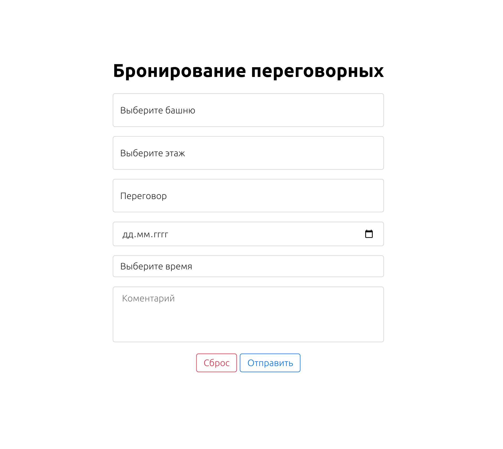

# Meeting room booking form
## Test assignment for an internship in VK

```
 Tech stack: React, ESLint
```
### The form contains the following elements:
* drop-down list with a choice of tower (A and B)
* drop-down list with a choice of floor (from 3 to 27)
* drop-down list with a choice of a meeting room (there are 10 meetings on each floor)
* comment input field (textarea)
* "Send" button (by clicking - output data to the console forms in the form of json)
* "Clear" button (clears the form at the beginning)



